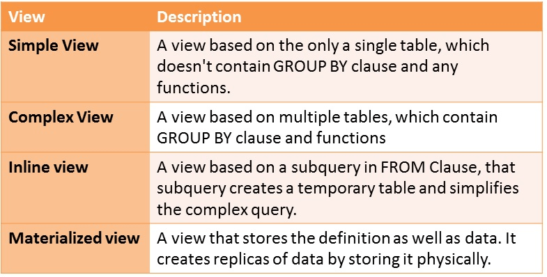

## View

## Description

1. View is a database object which is created over SQL querry.
2. View just represent data that is return by SQL querry.
3. View does not store data but every time you execute view it just execute the sql querry.
4. View is like a virtual table
5. The difference between table and view is the table stores data but view does not.
6. View Stores only data definition language 
7. View basically does not improve performance
8. View is just a another way to execute the SQL querry.
9. View always show latest data.

## Materialized View
 
1. Materialized View is a database object which is created over SQL querry.
2. When you create materialized view it does two things or basically it store two things
3. Stores the SQL querry (DDL) that is used to create that materialized view.
4. Stores the data that is returned from that SQL querry.
5. This is the reason why materialized view increases the performance of your querry
6. Materialized view does not provide the latest data.
7. Materialized view need refresh activity in order to get latest data.
8. Every time When we exceute the materialized view it did not go back and execute the querry again but what it did was it just went to materialized view it saw the data that was stored for this materialized view and it just returns that data.
 